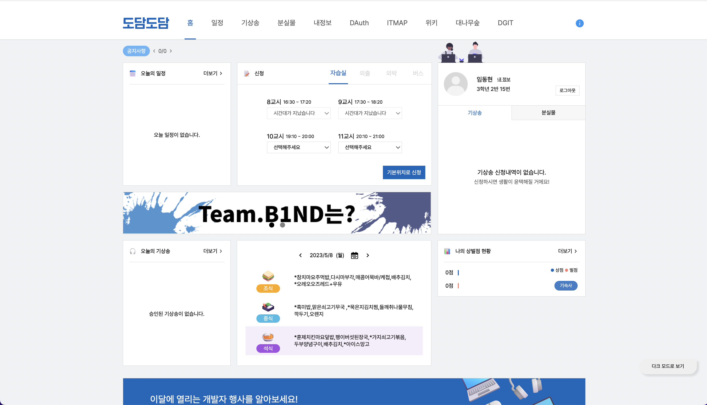
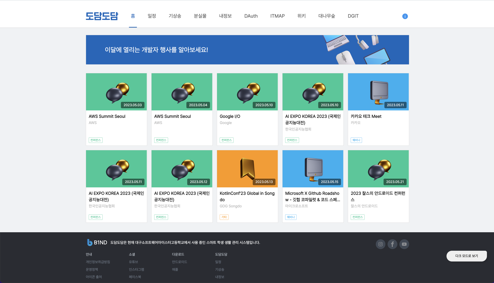

  

<h4 align="center">학생들을 위한, 학생들이 만든, 스마트스쿨 플랫폼</h4>

# [도담도담](https://dodam.b1nd.com/) 이란?

도담도담은 모든 학생과 모든 선생님에게 사고없이 편리함을 제공해줄 수 있는 스마트스쿨 플랫폼으로, 교내 전교생과 모든 선생님들이 사용하고 있어요.

> 아쉽지만 해당 서비스는 대소고학생 들만 사용할 수 있어요 🥲

# 도담도담 메인페이지에서 하는일은?

- 도담도담 메인페이지에서는 여러 신청(외출, 외박, 버스 신청)들을 통해 학생들을 관리하고 있어요!
- 그 외에도 오늘 승인된 기상송, 급식 정보, 오늘의 일정, 나의 상/벌점, 컨퍼런스 정보 등 학생들에게 도움이 되는 정보를 제공해요!

더욱 상세한 기능은 아래와 같아요!

## 기능 리스트

- 학생 관리 기능
  - 원래 직접 수기로 쓰던 (외출 신청, 외박 신청, 자습실 신청, 버스 신청) 같은 작업을 웹사이트로 신청 할 수 있습니다.
  - 자신의 기숙사 상,벌점을 조회 할 수 있습니다.
- 학생 편의 기능
  - 매일 아침에 기숙사에서 나오는 기상송을 자기가 듣고싶은 노래로 신청 할 수 있습니다.
  - 학생들에게 도움이 되는 컨퍼런스나 개발자 행사를 조회 할 수 있습니다.
  - 대구소프트웨어마이스터고등학교의 1년 급식표를 조회 할 수 있습니다.
  - 학생들이 잃어버린 분실물과 학생들이 획득한 습득물을 게시하여 물건을 찾거나 찾아줄 수 있습니다.
  - 대구소프트웨어마이스터고등학교의 오늘 일정을 조회할 수 있습니다.

# 메인페이지 화면

> 위 사진은 메인페이지 상단부에요. 왼쪽위부터 오늘의 일정, 신청 폼, 내정보, 배너, 오늘의 기상송, 급식정보, 나의 상벌점 등을 카드 형식으로 보여줘요.

> 위 사진은 메인페이지 하단부에요. 각종 컨퍼런스 정보와 푸터로 구성돼 있어요.

# 기술 스택

`TypeScript`, `React`, `Recoil`, `React-Query`, `Webpack`, `Styled-Components`, `Axios`
